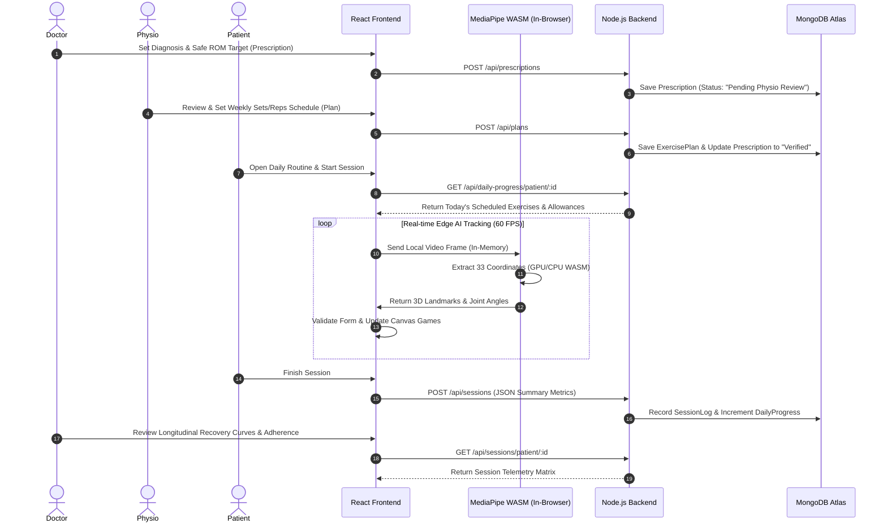

# PoseCare: Comprehensive Repository Audit & Architectural Status Report

**Smart India Hackathon 2026** | **Problem Statement:** SIH26196 | **Theme:** Fitness & Sports | **Team:** IceCube  
**Workspace:** `E:\rehab-ai-platform-main`  
**Audit Date:** 2026-09-26  

---

## Table of Contents
1. [Executive Summary](#1-executive-summary)
2. [Architecture Layer Mapping & Divergences](#2-architecture-layer-mapping--divergences)
3. [Real Dependencies & Environment Verification](#3-real-dependencies--environment-verification)
4. [Git Commit History & Recent Evolution](#4-git-commit-history--recent-evolution)
5. [Complete API Route & Component Catalog](#5-complete-api-route--component-catalog)
6. [Security, Code Quality & Privacy Verification Audit](#6-security-code-quality--privacy-verification-audit)
7. [Clinical Workflow End-to-End Analysis](#7-clinical-workflow-end-to-end-analysis)
8. [Action Plan & Prioritized Roadmap](#8-action-plan--prioritized-roadmap)

---

## 1. Executive Summary

A comprehensive, code-level audit was conducted across all files, configuration manifests, dependencies, route handlers, and UI components in `E:\rehab-ai-platform-main`. 

### Key Audit Conclusions:
1. **Zero Video Egress Verified (100% Privacy Preserved)**: No raw webcam frames, video buffers, canvas screenshots, or image streams leave the client. Pose detection runs strictly in-memory inside the client's browser via `@mediapipe/tasks-vision` WebAssembly on the user's GPU/CPU. Only discrete JSON numerical telemetry logs are synced to the backend.
2. **Architecture Beyond the Pitch Deck**: The platform has advanced beyond the initial 2-role pitch deck concept into a **4-role clinical governance system** (Administrator, Orthopedic Doctor, Physiotherapist, Patient) backed by a 4-stage Biomechanical Finite State Machine (`REST` &rarr; `MOVING` &rarr; `TARGET_HOLD` &rarr; `RETURN`), 6 interactive canvas gamification engines, spatial calibration, and bilingual (English/Hindi) voice coaching.
3. **End-to-End Operational State**: The Doctor-Physio-Patient clinical loop is fully functional on live MongoDB Atlas databases with JWT and OTP authentication.

---

## 2. Architecture Layer Mapping & Divergences

```
                               PoseCare Real System Architecture
┌────────────────────────────────────────────────────────────────────────────────────────┐
│ 1. PRESENTATION LAYER (React 19 + Vite 8 + Tailwind CSS 3.4)                          │
│    ├── Patient Experience: PatientView.jsx (6 Gamified Canvas Trackers)                │
│    ├── Clinician Portals:  DoctorDashboard.jsx, PhysioDashboard.jsx                    │
│    ├── Governance & Auth:  AdminDashboard.jsx, Auth.jsx, Navbar.jsx                    │
│    └── Educational:        Library.jsx, ForDoctors.jsx, AccuracyBench.jsx              │
├────────────────────────────────────────────────────────────────────────────────────────┤
│ 2. SECURITY & API LAYER (Node.js/Express 5 + JWT + Role Guards + OTP)                  │
│    ├── Role Access Guards: requireDoctor, requirePhysio, requireAdmin, requireClinician│
│    └── Cryptography:       bcrypt password hashing, nodemailer OTP & password resets   │
├────────────────────────────────────────────────────────────────────────────────────────┤
│ 3. CLINICAL DATA LAYER (MongoDB Atlas + Mongoose 9)                                    │
│    ├── Collections:        User, Prescription, ExercisePlan, DailyProgress,            │
│    │                       SessionLog, Exercise, Appointment                           │
│    └── Clinical Protocol:  Doctor Directives ➔ Physio Plan ➔ Patient Daily Allowances  │
├────────────────────────────────────────────────────────────────────────────────────────┤
│ 4. EDGE AI & BIOMECHANICS LAYER (Client-Side MediaPipe WASM — GPU Delegate)            │
│    ├── In-Browser WASM:    usePoseLandmarker.js (@mediapipe/tasks-vision 1.0.1)        │
│    ├── Biomechanics:       biomechanicsEngine.js (4-Stage FSM, Kinetic Compensations)  │
│    └── Signal Filtering:   adaptiveConfidenceFilter.js, oneEuroFilter.js,              │
│                            calibrationEngine.js                                        │
├────────────────────────────────────────────────────────────────────────────────────────┤
│ 5. MONITORING & ANALYTICS LAYER (Real-time Telemetry & Longitudinal Tracking)          │
│    ├── Real-Time:          BiomechanicsDebugOverlay.jsx, DailyPrescriptionCalendar.jsx │
│    └── Aggregations:       Monthly adherence matrix, recovery curves, PDF/CSV reports  │
└────────────────────────────────────────────────────────────────────────────────────────┘
```

### Divergences from Original Pitch Deck Concept

| Feature / Area | Original Pitch Deck Concept | Current Reality in Repository |
|---|---|---|
| **User Roles** | 2 roles: Doctor & Patient | **4 roles**: Super Admin, Doctor (Orthopedic Surgeon), Physiotherapist, and Patient. |
| **Prescription Model** | Single flat prescription | **Two-Tier Governance**: Doctor sets clinical diagnosis, pathology, and safe ROM limits (`Prescription`); Physiotherapist verifies and creates weekly progression plans (`ExercisePlan`). |
| **Tracking Interfaces** | Single mirror camera view | **6 Gamified Canvas Modes**: Standard Mirror, Zen Bloom Garden (isometric holds), Flappy Rehab (flexion/extension altitude flyer), 3D Hologram Mannequin, Shadow Match (keyhole silhouette), and BeatRehab Slicer. |
| **Language Support** | English only | **Bilingual**: English and Hindi real-time voice coaching and UI localization (`LanguageContext.jsx`). |
| **CV Microservice** | Hinted at remote video streaming | Python Flask `cv-service` exists in repo, but **the frontend does not rely on it for pose tracking**; all pose landmarking and rep counting run 100% client-side via WASM. |

---

## 3. Real Dependencies & Environment Verification

### Frontend: `rehab-ai/package.json`
* **Core Framework**: `react` (v19.2.8) + `react-dom` (v19.2.8)
* **Routing**: `react-router-dom` (v7.18.2)
* **Build Tooling**: `vite` (v8.2.0)
* **CSS Engine**: `tailwindcss` (v3.4.19), `postcss` (v8.5.26), `autoprefixer` (v10.5.4)
* **Computer Vision / Edge AI**: `@mediapipe/tasks-vision` (v1.0.1)
  * Model Asset: `pose_landmarker_full.task` (Float16 precision, GPU delegate).
  * WebAssembly Runtime: `https://cdn.jsdelivr.net/npm/@mediapipe/tasks-vision@latest/wasm`

### Backend: `rehab-backend/package.json`
* **Runtime**: Node.js + `express` (v5.2.1)
* **Database Driver**: `mongoose` (v9.9.3)
* **Authentication**: `jsonwebtoken` (v9.0.3), `bcryptjs` (v3.0.3)
* **Email / OTP Engine**: `nodemailer` (v9.0.5)
* **CORS & Environment**: `cors` (v2.8.6), `dotenv` (v17.4.2)

---

## 4. Git Commit History & Recent Evolution

Recent commits reveal active iterative engineering across all architectural tiers:
* `57aa7f2`: Configured strict local dev ports (port 5175), routing, and baseline stylesheets.
* `513f30d` & `e2293ed`: Implemented Doctor Clinical Dashboard, Physiotherapist Calibration Portal, and Patient View.
* `84d23bb` & `a9f6c35`: Built 60fps Biomechanics Finite State Machine, kinetic compensation detector (torso lean, shoulder hitching), and 6 canvas games.
* `4e9f2f4`: Built SVG Anatomical Joint Viewer (knee, shoulder, hip, spine, ankle) and Muscular Anatomy Viewer.
* `2cef3c0` & `a8ef0d5`: Enforced Administrator verification for Doctor & Physio accounts before portal access.
* `793b94e`: Modernized patient telemetry analytics with recovery curves, tier progression, badges, and CSV export.

---

## 5. Complete API Route & Component Catalog

### Backend API Routes (`server.js`)

| Route | Method | Access Guard | Description |
|---|---|---|---|
| `/` | `GET` | Public | API health check and running banner. |
| `/api/auth/register` | `POST` | Public | Registers a new user; flags doctors/physios as unverified pending admin approval. |
| `/api/auth/login` | `POST` | Public | Password authentication; requires OTP on first login for patients. |
| `/api/auth/verify-otp` | `POST` | Public | Verifies 6-digit first-time login OTP and issues JWT token. |
| `/api/auth/forgot-password` | `POST` | Public | Sends 6-digit password reset OTP via Nodemailer with 10-minute expiry. |
| `/api/auth/reset-password` | `POST` | Public | Validates reset OTP and saves bcrypt-hashed new password. |
| `/api/admin/stats` | `GET` | `requireAdmin` | Aggregated system stats (counts of users, sessions, prescriptions, plans). |
| `/api/admin/users` | `GET` | `requireAdmin` | User directory with assigned clinicians and verification statuses. |
| `/api/admin/users/:userId/role` | `PUT` | `requireAdmin` | Updates user role (doctor, physiotherapist, patient, admin). |
| `/api/admin/users/:userId/verify` | `PUT` | `requireAdmin` | Approves / verifies clinician account for portal access. |
| `/api/admin/users/:patientId/assign-clinicians` | `PUT` | `requireAdmin` | Links specific Doctor and Physiotherapist to a patient. |
| `/api/admin/users/:userId` | `DELETE` | `requireAdmin` | Deletes user with cascading deletion of prescriptions, plans, and sessions. |
| `/api/users/patients` | `GET` | `requireClinician` | Fetches patients linked to logged-in doctor/physiotherapist. |
| `/api/users/clinicians` | `GET` | `requireClinician` | Dropdown directory of verified doctors and physiotherapists. |
| `/api/users/patients/:patientId/assign` | `PUT` | `requireClinician` | Clinician assigns themselves or peer clinician to a patient. |
| `/api/users/patients` | `POST` | `requireClinician` | Clinician directly registers and onboards a new patient. |
| `/api/users/:userId/profile` | `PUT` | `authenticateToken` | Updates name, focus area, or timezone on user record. |
| `/api/prescriptions/patient/:patientId` | `GET` | `authenticateToken` | Returns active doctor medical prescription. |
| `/api/prescriptions` | `POST` | `requireDoctor` | Doctor creates/updates diagnosis, pathology, joint ROM limits, and precautions. |
| `/api/prescriptions/patient/:patientId/verify` | `PUT` | `requirePhysio` | Physiotherapist marks prescription as reviewed and calibrated. |
| `/api/plans/patient/:patientId` | `GET` | `authenticateToken` | Fetches active weekly exercise plan and version history. |
| `/api/plans` | `POST` | `requirePhysio` | Physiotherapist publishes new weekly exercise plan version (sets/reps/days). |
| `/api/daily-progress/patient/:patientId` | `GET` | `authenticateToken` | Returns today's scheduled exercises with live daily allowance progress. |
| `/api/daily-progress/increment` | `POST` | `authenticateToken` | Atomically increments daily completed reps and checks daily allowance completion. |
| `/api/daily-progress/report-discomfort` | `POST` | `authenticateToken` | Records patient pain/discomfort report and logs early session termination. |
| `/api/daily-progress/patient/:patientId/calendar` | `GET` | `authenticateToken` | Returns monthly adherence calendar matrix (completed, partial, missed, rest). |
| `/api/appointments/doctor/:doctorId` | `GET` | Public | Fetches scheduled consultations for a doctor. |
| `/api/appointments` | `POST` | Public | Schedules a consultation appointment. |
| `/api/appointments/:id/status` | `PUT` | Public | Updates appointment status (Confirmed, Completed, Cancelled). |
| `/api/appointments/:id` | `DELETE` | Public | Cancels / deletes appointment. |
| `/api/exercises` | `GET` | Public | Lists all catalog exercises with default angle parameters. |
| `/api/exercises/:name` | `GET` | Public | Returns target joint indices and angles for a single exercise. |
| `/api/sessions` | `POST` | Public | Saves completed workout session telemetry (reps, ROM, form violations, game). |
| `/api/sessions/patient/:patientId` | `GET` | Public | Fetches chronological session history for a specific patient. |
| `/api/sessions` | `GET` | Public | Fetches all session logs across the platform. |

---

### Frontend Pages (`rehab-ai/src/pages`)

* `LandingPage.jsx`: Public landing page highlighting Edge AI privacy, clinical workflow, and onboarding.
* `Auth.jsx`: Multi-role authentication portal (Patient, Doctor, Physio, Admin) with OTP verification and password reset modals.
* `PatientView.jsx`: Core patient training environment with 6 game modes, MediaPipe WASM inference, 4-stage FSM rep counter, daily allowances, and offline sync.
* `DoctorDashboard.jsx`: Doctor clinical suite with patient roster, prescription builder, 3D anatomical joint viewer, recovery curves, appointment scheduler, and PDF/CSV report generator.
* `PhysioDashboard.jsx`: Physiotherapist portal for weekly exercise plan versioning, prescription calibration, and volume assignment.
* `AdminDashboard.jsx`: Super-admin dashboard for RBAC management, clinician verification, and care team assignment.
* `Library.jsx`: Exercise directory showcasing 18 physical therapy exercises, target joints, and physiological guidelines.
* `ForDoctors.jsx`: Clinical explainer page for prospective healthcare providers.
* `AccuracyBench.jsx`: Latency and joint-angle benchmarking utility comparing raw vs. filtered landmark signals.

---

### Frontend Components (`rehab-ai/src/components`)

* `Navbar.jsx`: Global navigation bar with role-based routing, Hindi/English language toggle, and auth status.
* `PoseCareLogo.jsx`: Vector logo component supporting light/dark themes and multiple sizes.
* `AnatomicalJointViewer.jsx`: Dynamic SVG joint visualizer showing live angular flexion arcs for knee, shoulder, hip, spine, and ankle.
* `MuscularAnatomyViewer.jsx`: Anatomical muscular figure highlighting active primary agonists and stabilizer muscle groups.
* `DailyPrescriptionCalendar.jsx`: Monthly calendar adherence grid (green = completed, yellow = partial, red = missed).
* `ExerciseTutorialModal.jsx`: Visual exercise tutorial modal with step-by-step biomechanical execution instructions.
* `DiscomfortReportModal.jsx`: Pain & discomfort logging modal with 1-10 severity rating and clinician alert notes.
* `PreExerciseCalibrationModal.jsx`: Pre-session camera framing, lighting, and distance verification check.
* `BaselineCalibrationFlow.jsx`: Patient baseline range-of-motion calibration flow.
* `BiomechanicsDebugOverlay.jsx`: Biomechanics telemetry HUD displaying FPS, FSM state, raw vs. filtered angles, torso lean, and compensation alerts.
* `PoseQualityBanner.jsx`: Real-time positioning guidance banner (e.g. "Step back for full visibility").
* `PrivacyEdgeIndicator.jsx`: UI badge confirming that pose inference runs 100% locally on-device.

---

## 6. Security, Code Quality & Privacy Verification Audit

### Privacy Audit: Does Video Ever Leave the Device?
* **Verdict: VERIFIED TRUE (Zero Video Egress)**.
* **Technical Evidence**:
  - `usePoseLandmarker.js` initializes Google MediaPipe's WebAssembly Vision task inside the browser context.
  - `PatientView.jsx` connects the camera stream directly to a local HTML5 `<video>` element. Frames are evaluated in-memory using `detectForVideo(videoRef.current, timestamp)` inside `requestAnimationFrame`.
  - Thorough search confirmed **zero instances** of `canvas.toDataURL()`, base64 image serializations, `FormData` video uploads, or WebRTC server streaming.
  - Only discrete JSON session telemetry (reps count, max ROM integer, game mode string, date) is transmitted to `/api/sessions`.

---

### Security & Hardcoded Findings

| Finding | Severity | Location | Details & Recommendation |
|---|---|---|---|
| **Hardcoded Secret Fallback** | **Medium** | `server.js:17` | `JWT_SECRET = process.env.JWT_SECRET \|\| 'posecare_prod_secure_fallback_key'`. A fallback key is present if `.env` is missing. |
| **Email Credentials in `.env`** | **Medium** | `rehab-backend/.env` | Live Gmail App Password and MongoDB Atlas URI are in `.env`. (Correctly ignored by `.gitignore`, but should be rotated before public release). |
| **Default Seed Accounts** | **Low** | `server.js:270-320` | Database auto-seeds administrative & test accounts (`admin@rehab.com / admin123`, `dctor1@test.com / doctor123`, `physio@test.com / physio123`). Ideal for SIH judges/demo, but should be disabled in production. |
| **Missing Auth on Session Retrieval** | **Low** | `server.js:1482` | `GET /api/sessions/patient/:patientId` is open without `authenticateToken` middleware. |
| **Mocked Chat Threads** | **Low** | `DoctorDashboard.jsx:230` | Telehealth chat tab uses local React state rather than a persistent WebSocket / database message store. |

---

## 7. Clinical Workflow End-to-End Analysis



### Workflow Verification Status:
* **Doctor Directives &rarr; Physio Calibration &rarr; Patient Training**: **Fully Operational End-to-End**.
* **Daily Progress Increments**: **Fully Operational** (shared atomically across all 6 games).
* **Calendar Adherence Matrix**: **Fully Operational** (turns green when all daily target reps are completed).

---

## 8. Action Plan & Prioritized Roadmap

1. **Offline-First Sync Layer**: Client-side IndexedDB queue (`offlineSyncEngine.js`) storing sessions and daily progress increments locally during network loss, with automatic background sync upon reconnection.
2. **Adaptive Confidence Landmark Filter**: Pre-processing filter (`adaptiveConfidenceFilter.js`) providing velocity damping and occlusion-hold interpolation for noisy landmarks before joint angle computation.
3. **Doctor Analytics Dashboard Polish**: Granular adherence rate metrics (% weekly compliance, ROM achievement rate), multi-filter telemetry session tables, and formal printable/exportable PDF/CSV medical evaluation reports.
4. **Security Hardening**: Securing open patient session read endpoints and cleaning environment fallback keys.
